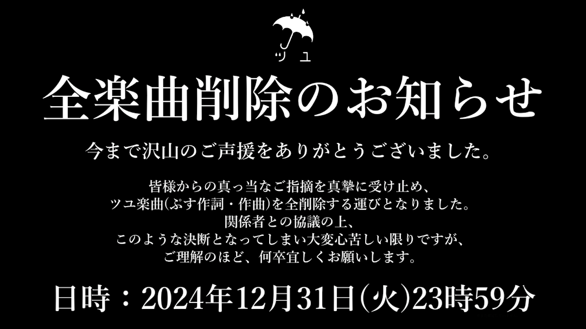

# ツユ計劃
 
一個完整的ツユ歌曲備份 
如果有任何問題或者歌曲遺失，歡迎打開一個新的問題或者拉取請求 

# ！！！重要！！！
根據ぷす的推文，他將會在`2024/12/31 23:59`移除所有的ツユ歌曲（應該包括MV）。因此我決定即日起逐漸追加歌曲MV並計劃於年底以前完成！ 

## 日誌
- 2024/09/22 
	更多單曲追加！ 
	特典歌曲的新來源 
	一些調整
- 2024/08/27 
	終点の先が在るとするならば。 (TUYU Remix) FLAC 來源 
- 2024/08/24 
	Leo/need SEKAI ALBUM Vol.2 與 どんな結末がお望みだい？/星空オーケストラ 的新FLAC來源 
	移除嵌入歌詞 
	使用GMxLRC重新下載歌詞 
	更多單曲

## 來源
| 專輯 | 來源 |
| -- | -- |
| Leo／need SEKAI ALBUM Vol.2 | CD ([Nyaa.si](https://nyaa.si)) |
| どんな結末がお望みだい？／星空オーケストラ | CD ([Nyaa.si](https://nyaa.si)) |
| やっぱり雨は降るんだね | CD ([Nyaa.si](https://nyaa.si)) |
| 貴方を不幸に誘いますね | CD ([Nyaa.si](https://nyaa.si)) |
| TUYU Piano Collection | [Miro's Twitter Posts](https://www.reddit.com/r/TUYU_official/comments/1dmkqpa/complete_tuyu_archive/) |
| アンダーメンタリティ | [ototoy.jp](https://ototoy.jp) |

## 資訊
「亞馬遜」和「安利美特」特典:
| \# | 標題 | 專輯 | 年份 | 位元速率 | 取樣率 | 時長 | 格式 | 歌詞 |
| -- | -- | -- | -- | -- | -- | -- | -- | -- |
| 1 | やっぱり雨は降るんだね Acoustic arrange ver. | やっぱり雨は降るんだね | 2020 | 775kbps | 44.1kHz | 03:34 | FLAC | No |
| 2 | くらべられっ子 Acoustic arrange ver. | やっぱり雨は降るんだね | 2020 | 806kbps | 44.1kHz | 03:37 | FLAC | No |
| 1 | ナツノカゼ御来光(TUYU arrange ver.) | 貴方を不幸に誘いますね(紙ジャケットCD付) | 2021 | 320kbps | 44.1kHz | 02:53 | MP3 | No |
| 1 | 梅雨明けの(TUYU arrange ver.) | 貴方を不幸に誘いますね(紙ジャケットCD付) | 2021 | 320kbps | 44.1kHz | 03:21 | MP3 | No |

單曲:
| \# | 標題 | 年份 | 位元速率 | 取樣率 | 時長 | 格式 | 歌詞 |
| -- | -- | -- | -- | -- | -- | -- | -- |
| 1 | くらべられっ子 (TUYU Remix) | 2020/6/1 | 1092kbps | 44.1kHz | 03:35 | FLAC | Yes |
| 1 | 終点の先が在るとするならば。 (TUYU Remix) | 2021/10/12 | 1948kbps | 48kHz | 02:59 | FLAC | Yes |
| 1 | それでも雨は降るんだね | 2024/04/15 | 1050kbps | 44.1kHz | 03:43 | FLAC | Yes |
| 1 | 革命前線 | 2023/10/30 | 1096kbps | 44.1kHz | 03:41 | FLAC | Yes |
| 1 | どんな結末がお望みだい？ | 2022/10/30 | 1036kbps | 44.1kHz | 03:20 | FLAC | Yes |
| 1 | デモーニッシュ | 2021/04/26 | 1041kbps | 44.1kHz | 02:41 | FLAC | Yes |
| 1 | かくれんぼっち | 2021 | 1008kbps | 44.1kHz | 03:14 | FLAC | Yes |
| 1 | 忠犬ハチ | 2021 | 848kbps | 44.1kHz | 03:01 | FLAC | Yes |
| 1 | いつかオトナになれるといいね。 | 2022 | 1934kbps | 48kHz | 02:55 | FLAC | Yes |
| 1 | アンダーキッズ | 2022 | 1938kbps | 48kHz | 03:26 | FLAC | Yes |
| 1 | 雨模様 | 2022 | 1800kbps | 48kHz | 02:43 | FLAC | Yes |
| 1 | 傷つけど、愛してる。 | 2023 | 1885kbps | 48kHz | 03:25 | FLAC | Yes |
| 1 | これだからやめらんない! | 2023 | 1931kbps | 48kHz | 02:45 | FLAC | Yes |
| 1 | アンダーヒロイン | 2023 | 1914kbps | 48kHz | 02:49 | FLAC | Yes |
| 1 | 終点の先が在るとするならば。 | 2021 | 1075kbps | 44.1kHz | 02:59 | FLAC | Yes |
| 1 | 泥の分際で私だけの大切を奪おうだなんて | 2020 | 1059kbps | 44.1kHz | 03:12 | FLAC | Yes |
| 1 | 雨を浴びる | 2020 | 987kbps | 44.1kHz | 03:20 | FLAC | Yes |

プロジェクトセカイ カラフルステージ！ feat.初音ミク (世界計畫 繽紛舞台 feat. 初音未來):
| \# | 標題 | 專輯 | 位元速率 | 取樣率 | 時長 | 格式 | 歌詞 |
| -- | -- | -- | -- | -- | -- | -- | -- |
| 1 | どんな結末がお望みだい？ (feat. 天馬司&鳳えむ&草薙寧々&神代類&初音ミク) | どんな結末がお望みだい？/星空オーケストラ | 1032kbps | 44.1kHz | 03:22 | FLAC | Yes |
| 5 | アサガオの散る頃に (feat. 星乃一歌&望月穂波&初音ミク) | Leo/need SEKAI ALBUM vol.2 | 936kbps | 44.1kHz | 03:23 | FLAC | No |

專輯:
| \# | 標題 | 專輯 | 年份 | 位元速率 | 取樣率 | 時長 | 格式 | 歌詞 |
| -- | -- | -- | -- | -- | -- | -- | -- | -- |
| 1 | やっぱり雨は降るんだね | やっぱり雨は降るんだね | 2020 | 1105kbps | 44.1kHz | 04:05 | FLAC | Yes |
| 2 | 夏浅し | やっぱり雨は降るんだね | 2020 | 761kbps | 44.1kHz | 01:23 | FLAC | No |
| 3 | 風薫る空の下 | やっぱり雨は降るんだね | 2020 | 1065kbps | 44.1kHz | 03:23 | FLAC | Yes |
| 4 | アサガオの散る頃に | やっぱり雨は降るんだね | 2020 | 1014kbps | 44.1kHz | 03:22 | FLAC | Yes |
| 5 | ひとりぼっちと未来 | やっぱり雨は降るんだね | 2020 | 783kbps | 44.1kHz | 02:28 | FLAC | Yes |
| 6 | あの世行きのバスに乗ってさらば。 | やっぱり雨は降るんだね | 2020 | 1098kbps | 44.1kHz | 03:15 | FLAC | Yes |
| 7 | 太陽になれるかな | やっぱり雨は降るんだね | 2020 | 1101kbps | 44.1kHz | 04:04 | FLAC | Yes |
| 8 | 羨望 | やっぱり雨は降るんだね | 2020 | 1040kbps | 44.1kHz | 01:48 | FLAC | No |
| 9 | くらべられっ子 | やっぱり雨は降るんだね | 2020 | 1122kbps | 44.1kHz | 03:34 | FLAC | Yes |
| 10 | ロックな君とはお別れだ | やっぱり雨は降るんだね | 2020 | 1112kbps | 44.1kHz | 03:28 | FLAC | Yes |
| 11 | ナミカレ | やっぱり雨は降るんだね | 2020 | 1119kbps | 44.1kHz | 04:10 | FLAC | Yes |
| 1 | 強欲 | 貴方を不幸に誘いますね | 2021 | 611kbps | 44.1kHz | 01:39 | FLAC | No |
| 2 | デモーニッシュ | 貴方を不幸に誘いますね | 2021 | 1047kbps | 44.1kHz | 02:39 | FLAC | Yes |
| 3 | 過去に囚われている | 貴方を不幸に誘いますね | 2021 | 982kbps | 44.1kHz | 03:48 | FLAC | Yes |
| 4 | 奴隷じゃないなら何ですか？ | 貴方を不幸に誘いますね | 2021 | 995kbps | 44.1kHz | 02:46 | FLAC | Yes |
| 5 | ルーザーガール | 貴方を不幸に誘いますね | 2021 | 1006kbps | 44.1kHz | 03:17 | FLAC | Yes |
| 6 | 雨を浴びる | 貴方を不幸に誘いますね | 2021 | 942kbps | 44.1kHz | 03:19 | FLAC | Yes |
| 7 | 秋雨前線 | 貴方を不幸に誘いますね | 2021 | 894kbps | 44.1kHz | 01:19 | FLAC | No |
| 8 | 忠犬ハチ | 貴方を不幸に誘いますね | 2021 | 844kbps | 44.1kHz | 03:01 | FLAC | Yes |
| 9 | テリトリーバトル | 貴方を不幸に誘いますね | 2021 | 1106kbps | 44.1kHz | 02:31 | FLAC | Yes |
| 10 | かくれんぼっち | 貴方を不幸に誘いますね | 2021 | 1018kbps | 44.1kHz | 03:13 | FLAC | Yes |
| 11 | 泥の分際で私だけの大切を奪おうだなんて | 貴方を不幸に誘いますね | 2021 | 1026kbps | 44.1kHz | 03:12 | FLAC | Yes |
| 12 | 終点の先が在るとするならば。 | 貴方を不幸に誘いますね | 2021 | 1040kbps | 44.1kHz | 02:59 | FLAC | Yes |
| 1 | Under Mentality | アンダーメンタリティ | 2023 | 1784kbps | 48kHz | 01:21 | FLAC | No |
| 2 | 不平不満の病 | アンダーメンタリティ | 2023 | 1686kbps | 48kHz | 00:21 | FLAC | Yes |
| 3 | アンダーキッズ | アンダーメンタリティ | 2023 | 1917kbps | 48kHz | 03:25 | FLAC | Yes |
| 4 | 腹黒女の戯言 | アンダーメンタリティ | 2023 | 1737kbps | 48kHz | 00:17 | FLAC | Yes |
| 5 | アンダーヒロイン | アンダーメンタリティ | 2023 | 1929kbps | 48kHz | 02:47 | FLAC | Yes |
| 6 | いつかオトナになれるといいね。 | アンダーメンタリティ | 2023 | 1934kbps | 48kHz | 02:54 | FLAC | Yes |
| 7 | 雨宿り | アンダーメンタリティ | 2023 | 1468kbps | 48kHz | 01:16 | FLAC | No |
| 8 | 雨模様 | アンダーメンタリティ | 2023 | 1812kbps | 48kHz | 02:42 | FLAC | Yes |
| 9 | レインフォール | アンダーメンタリティ | 2023 | 1911kbps | 48kHz | 03:45 | FLAC | Yes |
| 10 | これだからやめらんない! | アンダーメンタリティ | 2023 | 1912kbps | 48kHz | 02:44 | FLAC | Yes |
| 11 | 傷つけど、愛してる。 | アンダーメンタリティ | 2023 | 1887kbps | 48kHz | 03:23 | FLAC | Yes |
| 12 | 朧月夜物語 | アンダーメンタリティ | 2023 | 1765kbps | 48kHz | 03:07 | FLAC | Yes |
| 1 | 『どんな結末がお望みだい？』 piano ver. | TUYU Piano Collection | N/A | 64kbps | 48kHz | 00:51 | MP3 | No |
| 2 | 『霧雨の日に』 piano ver. | TUYU Piano Collection | N/A | 64kbps | 48kHz | 01:32 | MP3 | No |
| 3 | 『やっぱり雨は降るんだね』 piano ver. | TUYU Piano Collection | N/A | 64kbps | 48kHz | 01:36 | MP3 | No |
| 4 | 『雨模様』 piano ver. | TUYU Piano Collection | N/A | 64kbps | 48kHz | 01:38 | MP3 | No |
| 5 | 『アンダーキッズ』 piano ver. | TUYU Piano Collection | N/A | 64kbps | 48kHz | 01:31 | MP3 | No |
| 6 | 『風薫る空の下 』 piano ver. | TUYU Piano Collection | N/A | 64kbps | 48kHz | 01:48 | MP3 | No |
| 7 | 『雨宿り』 | TUYU Piano Collection | N/A | 64kbps | 48kHz | 01:17 | MP3 | No |
| 8 | 『忠犬ハチ』 piano ver. | TUYU Piano Collection | N/A | 64kbps | 48kHz | 01:02 | MP3 | No |
| 9 | 『かくれんぼっち』 piano ver. | TUYU Piano Collection | N/A | 64kbps | 48kHz | 01:29 | MP3 | No |
| 10 | 『泥の分際で私だけの大切を奪おうだなんて』 piano ver. | TUYU Piano Collection | N/A | 64kbps | 48kHz | 00:55 | MP3 | No |
| 11 | 「傷つけど、愛してる。」 piano ver. | TUYU Piano Collection | N/A | 64kbps | 48kHz | 01:37 | MP3 | No |
| 12 | 『梅雨明けの』 piano ver. | TUYU Piano Collection | N/A | 64kbps | 48kHz | 01:36 | MP3 | No |
| 13 | 『ルーザーガール』piano ver. | TUYU Piano Collection | N/A | 64kbps | 48kHz | 00:47 | MP3 | No |
| 14 | 『ロックな君とはお別れだ』 piano ver. | TUYU Piano Collection | N/A | 64kbps | 48kHz | 01:02 | MP3 | No |
| 15 | 『ナミカレ』 piano ver. | TUYU Piano Collection | N/A | 64kbps | 48kHz | 01:05 | MP3 | No |
| 16 | 『ナツノカゼ御来光』 piano ver. | TUYU Piano Collection | N/A | 64kbps | 48kHz | 01:39 | MP3 | No |
| 17 | 『雨のち雨』 | TUYU Piano Collection | N/A | 64kbps | 48kHz | 01:21 | MP3 | No |
| 18 | 『過去に囚われている』 piano ver. | TUYU Piano Collection | N/A | 64kbps | 48kHz | 00:50 | MP3 | No |
| 19 | 『ひとりぼっちと未来』 piano ver. | TUYU Piano Collection | N/A | 64kbps | 48kHz | 00:55 | MP3 | No |
| 20 | 『アサガオの散る頃に』 piano ver. | TUYU Piano Collection | N/A | 64kbps | 48kHz | 01:15 | MP3 | No |
| 21 | 『これだからやめらんない!』 piano ver. | TUYU Piano Collection | N/A | 64kbps | 48kHz | 00:54 | MP3 | No |
| 22 | 『雨を浴びる』 piano ver. | TUYU Piano Collection | N/A | 64kbps | 48kHz | 01:02 | MP3 | No |
| 23 | 『AFTER RAIN』 | TUYU Piano Collection | N/A | 64kbps | 48kHz | 00:36 | MP3 | No |
| 24 | 『奴隷じゃないなら何ですか？』 piano ver. | TUYU Piano Collection | N/A | 64kbps | 48kHz | 01:04 | MP3 | No |
| 25 | 『アンダーヒロイン』 piano ver. | TUYU Piano Collection | N/A | 64kbps | 48kHz | 00:36 | MP3 | No |
| 26 | 『アイドル』 YOASOBI piano ver. | TUYU Piano Collection | N/A | 64kbps | 48kHz | 00:55 | MP3 | No |
| 27 | 『ちゅ、多様性。』 ano piano ver. | TUYU Piano Collection | N/A | 64kbps | 48kHz | 01:15 | MP3 | No |
| 28 | 『テリトリーバトル』 piano ver. | TUYU Piano Collection | N/A | 64kbps | 48kHz | 01:15 | MP3 | No |
| 29 | 『シャーベット』 piano ver. | TUYU Piano Collection | N/A | 64kbps | 48kHz | 00:58 | MP3 | No |
| 30 | 『やっぱり雨は降るんだね』 music box ver. | TUYU Piano Collection | N/A | 64kbps | 48kHz | 01:30 | MP3 | No |
| 31 | 『太陽になれるかな』 piano ver. | TUYU Piano Collection | N/A | 64kbps | 48kHz | 01:11 | MP3 | No |
| 32 | 『夏浅し』 piano ver. | TUYU Piano Collection | N/A | 64kbps | 48kHz | 00:45 | MP3 | No |
| 33 | 『レインフォール』 piano ver. | TUYU Piano Collection | N/A | 64kbps | 48kHz | 01:04 | MP3 | No |
| 34 | 『朧月夜物語』 piano ver. | TUYU Piano Collection | N/A | 64kbps | 48kHz | 00:48 | MP3 | No |
| 35 | 『やっぱり雨は降るんだね』 harp ver. | TUYU Piano Collection | N/A | 64kbps | 48kHz | 01:48 | MP3 | No |
| 36 | 『羨望』 piano ver. | TUYU Piano Collection | N/A | 64kbps | 48kHz | 00:43 | MP3 | No |
| 37 | 『くらべられっ子』 piano ver. | TUYU Piano Collection | N/A | 64kbps | 48kHz | 01:07 | MP3 | No |
| 38 | 『アサガオの散る頃に』 music box ver. | TUYU Piano Collection | N/A | 64kbps | 48kHz | 01:27 | MP3 | No |
| 39 | 『地球儀』 米津玄師 piano ver. | TUYU Piano Collection | N/A | 64kbps | 48kHz | 01:47 | MP3 | No |
| 40 | 『強欲』 RH ver. | TUYU Piano Collection | N/A | 64kbps | 48kHz | 01:45 | MP3 | No |
| 41 | 『レインフォール』 music box ver. | TUYU Piano Collection | N/A | 64kbps | 48kHz | 01:35 | MP3 | No |
| 42 | 『いつかオトナになれるといいね。』 piano ver. | TUYU Piano Collection | N/A | 64kbps | 48kHz | 00:59 | MP3 | No |
| 43 | 『くらべられっ子』 music box ver. | TUYU Piano Collection | N/A | 64kbps | 48kHz | 01:34 | MP3 | No |
| 44 | 『シャーベット』 music box ver. | TUYU Piano Collection | N/A | 64kbps | 48kHz | 01:10 | MP3 | No |
| 45 | 『デモーニッシュ』 piano ver. | TUYU Piano Collection | N/A | 64kbps | 48kHz | 00:50 | MP3 | No |
| 46 | 『泥の分際で私だけの大切を奪おうだなんて』 music box ver. | TUYU Piano Collection | N/A | 64kbps | 48kHz | 01:32 | MP3 | No |
| 47 | 『アンダーキッズ』 harp ver.  | TUYU Piano Collection | N/A | 64kbps | 48kHz | 01:57 | MP3 | No |
| 48 | 『雨模様』 harp ver. | TUYU Piano Collection | N/A | 64kbps | 48kHz | 02:05 | MP3 | No |
| 49 | 『ルーザーガール』 music box ver. | TUYU Piano Collection | N/A | 64kbps | 48kHz | 01:16 | MP3 | No |
| 50 | 『太陽になれるかな』 music box ver. | TUYU Piano Collection | N/A | 64kbps | 48kHz | 01:28 | MP3 | No |
| 51 | 『革命前線』 piano ver. | TUYU Piano Collection | N/A | 64kbps | 48kHz | 00:48 | MP3 | No |
| 52 | 『ひとりぼっちと未来』 music box ver. | TUYU Piano Collection | N/A | 64kbps | 48kHz | 01:09 | MP3 | No |
| 53 | 『雨を浴びる』 music box ver. | TUYU Piano Collection | N/A | 64kbps | 48kHz | 01:38 | MP3 | No |
| 54 | 『ナミカレ』 music box ver. | TUYU Piano Collection | N/A | 64kbps | 48kHz | 01:22 | MP3 | No |
| 55 | 『ロックな君とはお別れだ』 music box ver. | TUYU Piano Collection | N/A | 64kbps | 48kHz | 01:12 | MP3 | No |
| 56 | 『テリトリーバトル』 music box ver. | TUYU Piano Collection | N/A | 64kbps | 48kHz | 02:08 | MP3 | No |
| 57 | 『どんな結末がお望みだい？』 music box ver. | TUYU Piano Collection | N/A | 64kbps | 48kHz | 00:54 | MP3 | No |
| 58 | 『過去に囚われている』 music box ver. | TUYU Piano Collection | N/A | 64kbps | 48kHz | 01:14 | MP3 | No |
| 59 | 『雨のち雨』 X'mas ver | TUYU Piano Collection | N/A | 64kbps | 48kHz | 01:30 | MP3 | No |
| 60 | 『アサガオの散る頃に』 正月ver | TUYU Piano Collection | N/A | 64kbps | 48kHz | 01:44 | MP3 | No |
| 61 | 『傷つけど、愛してる。』 music box ver. | TUYU Piano Collection | N/A | 64kbps | 48kHz | 01:41 | MP3 | No |
| 62 | 『あの世行きのバスに乗ってさらば。』 piano ver. | TUYU Piano Collection | N/A | 64kbps | 48kHz | 00:32 | MP3 | No |
| 63 | 『かくれんぼっち』 music box ver. | TUYU Piano Collection | N/A | 64kbps | 48kHz | 01:07 | MP3 | No |
| 64 | 『革命前線』 music box ver. | TUYU Piano Collection | N/A | 64kbps | 48kHz | 01:24 | MP3 | No |
| 65 | 『終点の先が在るのならば』 piano ver. | TUYU Piano Collection | N/A | 64kbps | 48kHz | 00:56 | MP3 | No |
| 66 | 『雨のち雨』 東京夜公演 RH ver | TUYU Piano Collection | N/A | 64kbps | 48kHz | 01:27 | MP3 | No |
| 67 | 『くらべられっ子』 harp ver. | TUYU Piano Collection | N/A | 64kbps | 48kHz | 01:34 | MP3 | No |
| 68 | 『あの世行きのバスに乗ってさらば。』 music box ver. | TUYU Piano Collection | N/A | 64kbps | 48kHz | 00:35 | MP3 | No |
| 69 | 『忠犬ハチ』 music box ver. | TUYU Piano Collection | N/A | 64kbps | 48kHz | 01:21 | MP3 | No |
| 70 | 『アンダーヒロイン』 music box ver. | TUYU Piano Collection | N/A | 64kbps | 48kHz | 01:02 | MP3 | No |
| 71 | 『いつかオトナになれるといいね。』 music box ver. | TUYU Piano Collection | N/A | 64kbps | 48kHz | 00:59 | MP3 | No |
| 72 | 『これだからやめらんない!』 music box ver. | TUYU Piano Collection | N/A | 64kbps | 48kHz | 01:12 | MP3 | No |
| 73 | 『デモーニッシュ』 piano solo ver. | TUYU Piano Collection | N/A | 64kbps | 48kHz | 00:18 | MP3 | No |
| 74 | 『終点の先が在るとするならば。』 music box ver. | TUYU Piano Collection | N/A | 64kbps | 48kHz | 01:24 | MP3 | No |
| 75 | 『それでも雨は降るんだね』 piano ver. | TUYU Piano Collection | N/A | 64kbps | 48kHz | 00:58 | MP3 | No |
